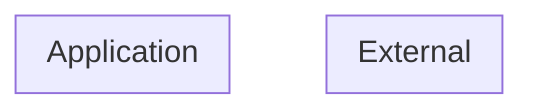

# Threat Model (auto-generated)

Generated by agentic-security on 2026-08-01.

This threat model is derived from static analysis of the current codebase and is regenerated on every scan. It is intended as a working artifact, not a finished compliance document.

## Entities + boundaries

## Assets

## STRIDE threats

## Attack trees
